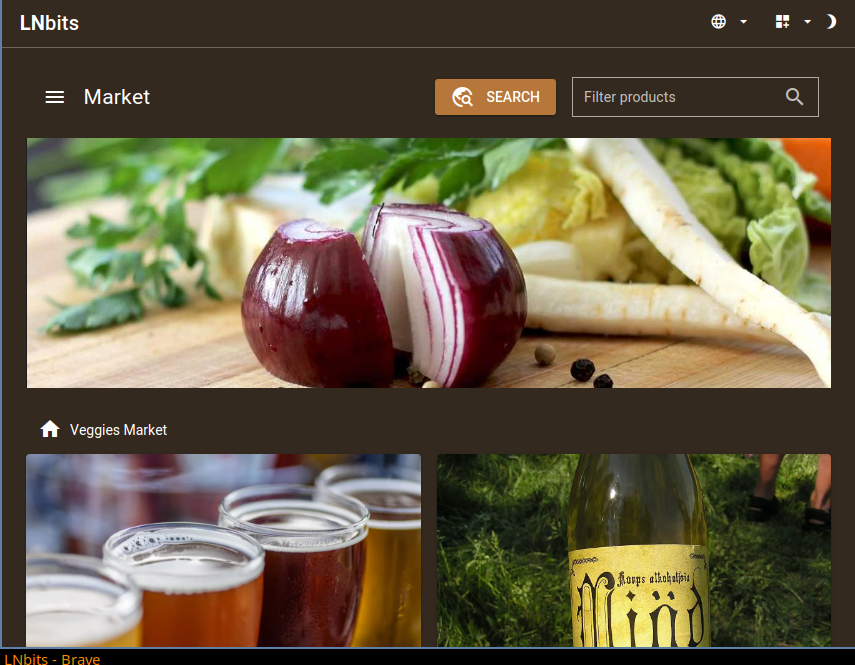

# Diagon Alley

<p align="center">
  
</p>

<p align="center">
  <strong>Public Nostr Marketplace Aggregator</strong>
</p>

<p align="center">
  An LNbits extension for browsing and discovering products from multiple Nostr merchants.
</p>

---

## Overview

Diagon Alley is a public-facing marketplace aggregator that allows users to browse products from multiple Nostr merchants in one place. It implements the buyer/browser side of the Nostr marketplace protocol, making it easy to discover and purchase products using Lightning Network payments.



## Features

- **Browse Multiple Merchants** - Discover products from various Nostr vendors in a single interface
- **Import Merchants** - Add merchants by their public key or `naddr` identifier
- **Search & Filter** - Find products across all connected merchants
- **No Account Required** - Browse the marketplace without logging in
- **Lightning Payments** - Pay for products instantly via the Lightning Network

## Nostr Protocol Support

### NIP-15: Nostr Marketplace

Diagon Alley implements [NIP-15](https://github.com/nostr-protocol/nips/blob/master/15.md) for marketplace functionality:

- Product listings (kind 30018)
- Stall/merchant information (kind 30017)
- Direct messages for orders

### NIP-99: Classified Listings (Coming Soon)

Support for [NIP-99](https://github.com/nostr-protocol/nips/blob/master/99.md) classified listings is planned for a future release.

### Gamma Market Spec

Compatible with the [Gamma Market](https://github.com/ArcadeLabsInc/gamma) specification for enhanced marketplace features.

## Installation

### As an LNbits Extension

1. Clone this repository into your LNbits extensions folder:

   ```bash
   cd /path/to/lnbits/lnbits/extensions
   ln -s /path/to/diagon-alley diagonalley
   ```

2. Restart LNbits

3. Enable the extension in the LNbits admin panel under **Extensions > Installed**

### Routes

| Route                 | Description            | Auth Required     |
| --------------------- | ---------------------- | ----------------- |
| `/diagonalley/`       | Extension landing page | Yes (LNbits user) |
| `/diagonalley/market` | Public marketplace     | No                |

The public marketplace URL can be shared with anyone - no login required.

## Development

### Prerequisites

- Python 3.10+
- LNbits 1.4.0+
- Node.js (for frontend development)

### Local Development

```bash
# Clone the repository
git clone https://github.com/BenGWeeks/diagon-alley.git

# Create symbolic link in LNbits
ln -s /path/to/diagon-alley /path/to/lnbits/lnbits/extensions/diagonalley

# Run LNbits
cd /path/to/lnbits
uv run lnbits --port 5000
```

### Code Formatting

```bash
uvx black .
uvx ruff check --fix .
```

## Related Projects

- [Nostr Market](https://github.com/lnbits/nostrmarket) - Merchant stall management extension
- [LNbits](https://github.com/lnbits/lnbits) - Lightning Network wallet/accounts system
- [Nostr Protocol](https://github.com/nostr-protocol/nostr) - The Nostr protocol specification

## Contributing

Contributions are welcome! Please feel free to submit a Pull Request.

## License

MIT License - see [LICENSE](LICENSE) for details.
